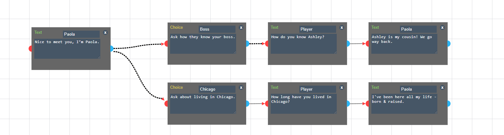

# Talkit

A customized fork of Talkit for used to generate structured dialogue for games in [mikewesthad/financial-literacy-playlist-games](https://github.com/mikewesthad/financial-literacy-playlist-games)

Talkit is originally a fork of [et1337's](https://github.com/et1337) wonderful [The Poor Man's Dialogue Tree](http://et1337.com/2014/05/16/the-poor-mans-dialogue-tree/) which is currently part of [Lemma](https://github.com/et1337/Lemma) project.

## Description

Talkit is a non-linear, node based, game dialog editor. It runs on [jointJS](http://www.jointjs.com/). It exports to JSON with game ready content.



Example game format:

```js
[
  {
    type: "Text",
    id: "92b0872d-f0b2-472e-9d8d-1e9080a88014",
    actor: "Paola",
    name: "Nice to meet you, I’m Paola.",
    choices: [
      "28e003da-1197-4b67-aeee-e73562c1f434",
      "8c07518d-79c4-4ec6-aa55-2fdb465f2360"
    ]
  },
  {
    type: "Choice",
    id: "28e003da-1197-4b67-aeee-e73562c1f434",
    title: "Boss",
    name: "Ask how they know your boss.",
    next: "103d17f3-cdcd-4a8c-9c6a-01ee9ce7dfc9"
  },
  {
    type: "Choice",
    id: "8c07518d-79c4-4ec6-aa55-2fdb465f2360",
    title: "Chicago",
    name: "Ask about living in Chicago.",
    next: "8dc41ced-5e3f-4fd6-8f6e-340828e0f9da"
  }
];
```

## Usage

Installation:

```
npm install
```

Running:

```
npm run dev
```

## Nodes

### Text

Display a message from the specified actor.  
Actor: Specify the actor who will say the speech.  
Speech: The text the actor will say.

### Choice

Intended to populate the players choices for responses.  
Title: The title of the choice. This is useful for cases when the buttons the player would have to chose from
will differ from the actual speech he will say.
Speech: The text the actor will say.

## Unused Nodes (from original readme)

### Set

Sets a variable to a value. Can link to one Text, Node, Set, or Branch.

### Branch

Takes one of several paths based on the value of a variable. Each port can link to one Text, Node, Set, or Branch.

### Node

Does nothing. Can link to one Text, Node, Set, or Branch, or to one or more Choices.

```

```
